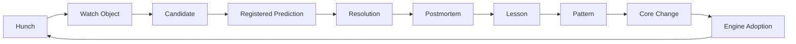

# How Metis Learns

Metis learns by turning judgment into objects, then deciding which objects are
allowed to move upward into memory, lessons, patterns, and core rules.

The system is deliberately not a straight line from idea to prediction. Most
ideas should not become registered forecasts. Some should remain hunches. Some
should become watch objects. Some should teach the engine without entering the
calibration record.

## The Learning Loop

This loop is less about automation than memory discipline. Each step asks a
simple question: is this object mature enough to move upward, or should it stay
local, provisional, or private?

## Step 1: Hunch

A hunch is an early directional thought. It is allowed to be incomplete. Its job
is to preserve a possible edge before the system has enough evidence to shape it.

A good hunch records:

- what might be true,
- why it might matter,
- what would make it observable,
- and which engine owns the context.

A hunch should not be scored.

## Step 2: Watch Object

A watch object is a structured observation target. It has enough shape to be
tracked, but not enough maturity to enter calibration.

Watch objects are important because they let Metis learn from events without
pretending that every useful pre-event thought deserved formal registration.

This is one of the system's main anti-self-deception tools.

## Step 3: Candidate

A candidate is a possible prediction or thesis object. It should have a clearer
question, a known evidence gap, and a reason it might be non-consensus.

Before promotion, the engine should ask:

- Is the object well-defined?
- Is the resolution rule clear?
- Has the relevant lesson memory been recalled?
- Is evidence strong enough for a registered claim?
- Is human review needed before freeze?

## Step 4: Registered Prediction

A registered prediction is frozen before the event. It has a defined question,
time boundary, resolution rule, and evidence state.

This is the calibration layer. It should be protected. A system that registers
too much too early becomes noisy; a system that registers only after the fact is
not learning honestly.

## Step 5: Resolution

Resolution ties the object to observed evidence. It should use official or
approved evidence where possible, and it should not rewrite the original object
to make the result look cleaner.

A resolution can show that the prediction was correct while still revealing that
the prediction was too narrow.

## Step 6: Postmortem

A postmortem asks what the event taught the engine beyond the score.

Useful postmortems separate:

- what the system got right,
- what it missed,
- what object type was too narrow,
- which evidence was over- or under-weighted,
- and what should change next time.

The goal is not to celebrate or punish. The goal is to preserve learning before
memory degrades into a story.

## Step 7: Lesson

A lesson is a local, reusable observation. It is stronger than a postmortem note
but weaker than a pattern.

A lesson should keep its source context visible. The same rule that helps one
engine can mislead another engine if the domain boundary is ignored.

## Step 8: Pattern

A pattern is a lesson that has survived compression. It has enough structure to
travel across cases, or sometimes across engines.

A pattern should pass:

- source review,
- counterexample search,
- golden-case checks,
- domain boundary review,
- and human approval when the blast radius is high.

## Step 9: Core Change

A core change modifies shared Metis behavior. It should be broadcast to affected
engines rather than silently absorbed.

Core changes can introduce:

- new schema expectations,
- new review cadence,
- new publication rules,
- new pattern adoption requirements,
- or new compatibility checks.

## Step 10: Engine Adoption

Each engine reviews the core change against its local domain. Adoption is not
assumed. The engine can adopt, adapt, defer, or reject with explanation.

This is how Metis avoids forcing one domain's lesson into every other domain.

## Why This Matters

Without this loop, a multi-engine system tends to fail in familiar ways:

- it remembers conclusions but loses evidence,
- it promotes anecdotes into rules,
- it confuses private reasoning with public claims,
- it overfits one successful event,
- or it lets each engine quietly reinvent the same workflow.

Metis learns by slowing down the movement from observation to rule. That slower
movement is the point.

## Public Boundary

The public site can show the learning loop, selected reports, and sanitized
patterns. It should not publish raw ledgers, unresolved prediction internals,
private schemas, or source archives.

The private workspace remains the memory. The public site explains the method.
